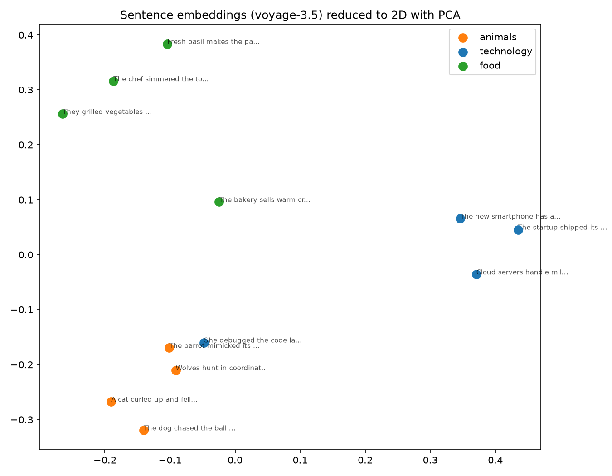

# embed-ai

Five small, runnable exercises building up from embeddings to a complete,
self-checking agent — no framework, no hidden magic, just the API calls
and the math.

- **Part 1 (this folder)** — turn sentences into embedding vectors, look
  at the raw numbers, measure how "close" two vectors are, and plot them
  in 2D so semantically similar sentences visibly cluster together.
- **Part 2 ([`rag-search-exercise/`](rag-search-exercise/))** — use those
  same vectors to retrieve relevant documents for a question, so Claude
  answers grounded in real text instead of guessing.
- **Part 3 ([`prompt-context-engineering/`](prompt-context-engineering/))**
  — five prompt engineering techniques in isolation, then a reframe:
  retrieval from Part 2 turns out to be one technique for engineering
  context, not a separate topic.
- **Part 4 ([`tool-use-agents/`](tool-use-agents/))** — Claude stops just
  answering and starts acting: an agentic loop where it can call a
  function, get a result, and use it — including wrapping Part 2's
  retrieval as a tool.
- **Part 5 ([`capstone/`](capstone/))** — all four parts combined into one
  agent over real PDF documents ([`mini-project-1-pdfs/`](mini-project-1-pdfs/)),
  plus two things every real Claude app needs: a self-grading eval script,
  and a guardrails check that uses Claude itself as a judge.

Do them in order — each part assumes you're comfortable with the one
before it.

---

## Part 1: Vectorization & Embeddings

Turn sentences into embedding vectors, look at the raw numbers, measure
how "close" two vectors are, and plot them in 2D so semantically similar
sentences visibly cluster together.



*Real output from a run of this script — 12 sentences across 3 topics
(animals, technology, food), embedded with Voyage AI and reduced to 2D with
PCA. Same-topic sentences land near each other automatically.*

## Why Voyage AI, not Claude?

The Claude API (including Haiku) is a text-generation model — it does not
produce embeddings. **Voyage AI** is Anthropic's recommended embeddings
provider and is what actually turns text into vectors here. This project
uses:

- **Voyage AI** (`voyage-3.5`) — generates the embedding vectors
- **Claude Haiku** (`claude-haiku-4-5`) — optional bonus step that explains
  in plain English why the clustering happened

## Setup

```bash
git clone https://github.com/arjunuvlad2/embed-ai.git
cd embed-ai
pip install -r requirements.txt
cp .env.example .env
```

Fill in `.env`:
- `VOYAGE_API_KEY` — **required**. Get one at https://dashboard.voyageai.com/
- `ANTHROPIC_API_KEY` — optional, only needed for the closing Claude Haiku
  explanation step. If it's missing (or invalid), the script still runs
  and produces the plot — it just skips that last step.

## Run

```bash
python embed_and_visualize.py
```

## What it does

1. Takes 12 short sentences across 3 topics (animals, technology, food)
2. Embeds all of them in one Voyage AI API call
3. Prints the raw vector shape and the first few numbers of one vector
4. Computes cosine similarity to show same-topic sentences score higher
   than different-topic sentences
5. Reduces the high-dimensional vectors to 2D with PCA and saves a scatter
   plot (`embeddings_plot.png`) — you should see three visible clusters,
   like the one above
6. If `ANTHROPIC_API_KEY` is set and valid, asks Claude Haiku to explain
   the result in plain English

## Example output

```
Embedding 12 sentences with Voyage AI (voyage-3.5)...

Vector shape: (12, 1024)  -> each sentence became a 1024-dimensional vector
First 8 numbers of sentence 0's vector:
  [-0.015   0.0451 -0.0128  0.0335  0.0279 -0.0134 -0.0222 -0.0541]

Cosine similarity from sentence 0:
  to another 'animals' sentence -> 0.7773
  to a 'technology' sentence -> 0.6314

Reducing 1024-ish dimensions down to 2D with PCA so we can actually plot it...
Saved plot to embeddings_plot.png
```

## Things to try next

- Swap in your own sentences/categories in `SENTENCES_BY_CATEGORY`
- Try a different Voyage model (`voyage-3-large` for higher quality,
  `voyage-3.5-lite` for cheaper/faster) and compare the plot
- Swap PCA for `sklearn.manifold.TSNE` and compare the layout
- Print the full similarity matrix instead of just one row

---

## Part 2: Semantic Search & RAG

Once Part 1 makes sense, head into
[`rag-search-exercise/`](rag-search-exercise/) — same embedding model,
same cosine similarity math, now used to retrieve relevant documents for
a question so Claude answers grounded in real text instead of guessing.
Full setup and run instructions are in that folder's own README.

## Part 3: Prompt & Context Engineering

Once Part 2 makes sense, head into
[`prompt-context-engineering/`](prompt-context-engineering/) — five
prompt engineering techniques (clarity, few-shot, system prompts,
structured outputs, chain of thought), each demonstrated as a real
before/after API call. Then a reframe: retrieval from Part 2 is one
specific technique for engineering *context*, not a separate topic. Full
setup and run instructions are in that folder's own README.

## Part 4: Tool Use & Agents

Once Part 3 makes sense, head into
[`tool-use-agents/`](tool-use-agents/) — the agentic loop: Claude asks to
call a function, your code runs it and hands back a result, repeat until
it has a final answer. Culminates in a small agent that wraps Part 2's
retrieval as one tool alongside a second, non-retrieval tool, so some
questions genuinely need both. Full setup and run instructions are in
that folder's own README.

## Part 5: Capstone

Once Part 4 makes sense, head into [`capstone/`](capstone/) — every prior
part combined into one three-tool agent running over the 10 real PDF
policy documents in [`mini-project-1-pdfs/`](mini-project-1-pdfs/)
(embeddings + retrieval from Parts 1–2, a tight system prompt from Part 3,
the agentic loop from Part 4). Then two more things: `eval_capstone.py`
runs a small golden-question set against the agent and scores it
automatically, and `guardrails_check.py` fires adversarial questions at
it and uses a second Claude call as a judge to grade the responses — the
same "LLM-as-judge" pattern real eval pipelines use. Full setup and run
instructions are in that folder's own README.

## License

MIT — see [LICENSE](LICENSE).
